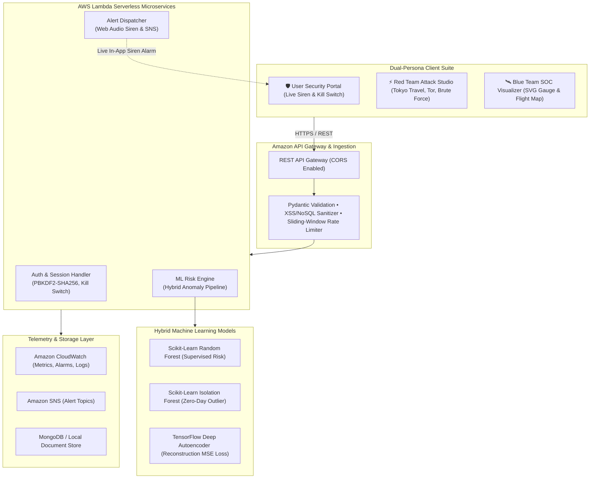

# 🛡️ Real-Time Account Hijacking Detection and Prevention System (AWSSecurity AI)


A cloud-native cybersecurity platform built on AWS Serverless architecture that leverages hybrid Machine Learning to detect, analyze, alert, and automatically block account takeover and session hijacking attempts in real time.

---

## 🏗️ System Architecture

The platform enforces **Continuous Behavioral Authentication**. Rather than trusting static passwords alone, incoming telemetry is evaluated by an ML inference pipeline to automatically neutralize compromised sessions.



---

## 🧠 Multi-Layer Machine Learning Risk Engine

### 7-Dimensional Behavioral Feature Vector
Incoming sessions are transformed into a normalized behavioral vector:

| Feature | Description | Anomaly Trigger |
| :--- | :--- | :--- |
| **`geo_velocity_kmh`** | Haversine velocity between successive logins | $> 900\text{ km/h}$ (Impossible Travel) |
| **`distance_km`** | Physical geographic distance from baseline | Sudden intercontinental jump |
| **`device_distance`** | Canvas fingerprint, OS, user-agent divergence | Unrecognized hardware canvas |
| **`ip_reputation`** | Tor exit relays and datacenter proxies | Verified Tor exit node ($= 1.0$) |
| **`failed_attempts_burst`** | Velocity of recent failed password attempts | $> 3\text{ failed attempts in 10 min}$ |
| **`circadian_anomaly`** | Deviation from historical active login hours | Activity during off-hours |
| **`bot_signature`** | Headless browser markers and automation flags | Automation signals detected |

### Hybrid Models & Policy Actions
- **Scikit-Learn Random Forest**: Evaluates supervised compromise probability ($0 - 100\%$).
- **Scikit-Learn Isolation Forest**: Identifies unsupervised zero-day behavioral anomalies.
- **TensorFlow Deep Autoencoder (7-4-2-4-7)**: Flags anomalies when reconstruction error exceeds threshold ($\text{MSE} > 0.12$).
- **Explainable AI (XAI)**: Generates human-readable factor attribution weights for every security event.

| Risk Score | Action | Automated Enforcement |
| :---: | :---: | :--- |
| **0 – 39** | `ALLOW` | Standard session access granted |
| **40 – 69** | `CHALLENGE_MFA` | Adaptive Step-Up 6-digit OTP verification challenge |
| **70 – 100** | `BLOCK_SESSION` | Session revoked, Web Audio siren sounds, CloudWatch incremented, SNS dispatched |

---

## 🔒 Security Hardening Controls

- **PBKDF2-HMAC-SHA256**: 200,000 hashing rounds with 16-byte cryptographic salts (`secrets.token_hex`).
- **Sliding-Window Rate Limiting**: 5 failed login attempts per 10-minute window enforces a 15-minute lockout.
- **Input Sanitization**: Neutralizes XSS tags and NoSQL injection operators (`$where`, `$gt`, `$ne`, prototype pollution).
- **Anti-Enumeration Generic Messaging**: Standardized *"Invalid credentials or account restricted"* responses.
- **Primary Device Governance & Kill Switch**: Master device retains sole revocation authority over secondary sessions.

---

## 🚀 Quick Start (Running Locally)

Zero AWS cloud dependencies or external databases required—includes built-in local document storage and SIEM telemetry.

### Prerequisites
- Python 3.10+ (tested on Python 3.10 – 3.14)

### 1. Install & Verify
```bash
# Clone & enter directory
cd aws-security-main

# Install dependencies
pip install -r requirements.txt

# Run automated tests
python -m unittest tests/test_backend.py
```

### 2. Launch Standalone Cyber Defense Platform
```bash
python run_standalone.py
```
Open **`http://127.0.0.1:8000`** in your browser. *(Or use `docker-compose up --build`)*

### Seeded Demonstration Accounts
| Persona | Email | Password | Baseline Location |
| :--- | :--- | :--- | :--- |
| **Primary Demo User** | `demo@awssecurity.io` | `AWSSecurity#2026` | New York, US |
| **Legacy Demo User** | `demo@aegisguard.io` | `AegisGuard#2026` | New York, US |

---

## 🎯 Two-Browser Live Demonstration Guide

Demonstrate real-time attack detection and automated prevention on a single machine:

1. **Browser 1 (Chrome — Legitimate User)**:
   - Go to `http://127.0.0.1:8000`, click **`👤 Fill Demo User (Sachin)`**, and log in.
   - Click **`🛡️ Yes, Register as My Primary Device`** when prompted. Notice `🔊 Sound: ON`.
2. **Browser 2 (Edge / Incognito — Attacker)**:
   - Open `http://127.0.0.1:8000` and switch to the **`⚡ Attack Simulator`** tab.
   - Select `demo@awssecurity.io` and click **`Launch Scenario`** under **Impossible Travel (Tokyo, 8,500 km/h)**.
3. **Observe Automated Defense in Browser 1**:
   - Within 2 seconds, Browser 1 **sounds an audible siren alarm** and displays a pulsing crimson alert banner.
   - The threat card arrives in the **Security Alerts Inbox** with an XAI factor breakdown.
   - Switch to **`🛰️ SOC Blue Team`** to inspect the SVG risk needle spike and the flight trajectory map.
   - Switch to **`📊 Telemetry & SIEM`** to verify that `BlockedHijacks` incremented in CloudWatch.

---

## ☁️ AWS Cloud Production Deployment

Deploy the serverless stack to AWS using the provided SAM template (`aws/template.yaml`):

```bash
cd aws
sam build
sam deploy --guided
```

**Provisions**: Amazon API Gateway, 3 AWS Lambda functions (Auth, Risk Engine, Alert Dispatcher), CloudWatch Log Group (`/aws/lambda/AccountHijackRiskEngine`), CloudWatch Alarm (`HighRiskRateAlarm`), and Amazon SNS Topic.

---

## 📁 Repository Structure

```
aws-security-main/
├── README.md                 # System overview & quickstart
├── PRACTICE.md               # Viva defense guide & exam Q&A
├── requirements.txt          # Python dependencies (FastAPI, Scikit-learn, etc.)
├── run_standalone.py         # Zero-AWS one-click standalone runner
├── docker-compose.yml        # Multi-container Docker setup with MongoDB 7.0
├── aws/                      # SAM template, CloudWatch dashboard & Lambda handlers
├── backend/                  # FastAPI REST API, hybrid ML models & security controls
├── database/                 # Transparent document store & MongoDB schemas
└── frontend/                 # Dual-persona UI (User Portal, Attack Studio, SOC, SIEM)
```

---

## 📄 License
This project is licensed under the **MIT License**.
